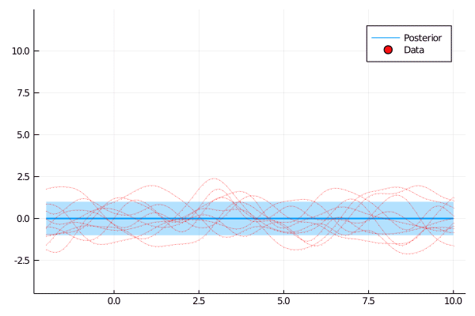

# AbstractGPs

[](https://JuliaGaussianProcesses.github.io/AbstractGPs.jl/stable)
[](https://JuliaGaussianProcesses.github.io/AbstractGPs.jl/dev)
[](https://travis-ci.com/JuliaGaussianProcesses/AbstractGPs.jl)
[](https://codecov.io/gh/JuliaGaussianProcesses/AbstractGPs.jl)
[](https://github.com/invenia/BlueStyle)
[](https://github.com/SciML/ColPrac)

AbstractGPs.jl is a package that defines a low-level API for working with Gaussian processes (GPs), and basic functionality for working with them in the simplest cases. As such it is aimed more at developers and researchers who are interested in using it as a building block than end-users of GPs.




## Features

### Setup
```julia
using AbstractGPs, KernelFunctions, Random
rng = MersenneTwister(0)

# Construct a zero-mean Gaussian process with a matern-3/2 kernel.
f = GP(Matern32Kernel())

# Specify some input and target locations.
x = randn(rng, 10)
y = randn(rng, 10)
```

### Finite dimensional projection
Look at the finite-dimensional projection of `f` at `x`, under zero-mean observation noise with variance `0.1`.
```julia
fx = f(x, 0.1)
```

### Sample from GP from the prior at `x` under noise.
```julia
y_sampled = rand(rng, fx)
```

### Compute the log marginal probability of `y`.
```julia
logpdf(fx, y)
```

### Construct the posterior process implied by conditioning `f` at `x` on `y`.
```julia
f_posterior = posterior(fx, y)
```

### A posterior process follows the `AbstractGP` interface, so the same functions which work on the posterior as on the prior.

```julia
rand(rng, f_posterior(x))
logpdf(f_posterior(x), y)
```

### Compute the VFE approximation to the log marginal probability of `y`.
Here, z is a set of pseudo-points. 
```julia
z = randn(rng, 4)
u = f(z)
```

### Evidence Lower BOund (ELBO)
We provide a ready implentation of elbo w.r.t to the pseudo points. We can perform Variational Inference on pseudo-points by maximizing the ELBO term w.r.t pseudo-points `z` and any kernel parameters. For more information, see [examples](https://github.com/JuliaGaussianProcesses/AbstractGPs.jl/tree/master/examples). 
```julia
elbo(fx, y, u)
```

### Construct the approximate posterior process implied by the VFE approximation.
The optimal pseudo-points obtained above can be used to create a approximate/sparse posterior. This can be used like a regular posterior in many cases.
```julia
f_approx_posterior = approx_posterior(VFE(), fx, y, u)
```

### An approximate posterior process is yet another `AbstractGP`, so you can do things with it like
```julia
marginals(f_approx_posterior(x))
```

### Sequential Conditioning 
Sequential conditioning allows you to compute your posterior in an online fashion. We do this in an efficient manner by updating the cholesky factorisation of the covariance matrix and avoiding recomputing it from original covariance matrix.

```julia
# Define GP prior
f = GP(SqExponentialKernel())
```

#### Exact Posterior
```julia
# Generate posterior with the first batch of data on the prior f1.
p_fx = posterior(f(x[1:3], 0.1), y[1:3])

# Generate posterior with the second batch of data considering posterior p_fx1 as the prior.
p_p_fx = posterior(p_fx(x[4:10], 0.1), y[4:10])
```

#### Approximate Posterior
##### Adding observations in an sequential fashion
```julia
Z1 = rand(rng, 4)
Z2 = rand(rng, 3)
p_fx = approx_posterior(VFE(), f(x[1:7], 0.1), y[1:7], f(Z))
u_p_fx = update_approx_posterior(p_fx1, f(x[8:10], 0.1), y[8:10])
```
##### Adding pseudo-points in an sequential fashion
```julia

p_fx1 = approx_posterior(VFE(), f(X, 0.1), y, f(Z1))
u_p_fx1 = update_approx_posterior(p_fx1, f(Z2))
```

## Issues/Contributing

If you notice a problem or would like to contribute by adding more kernel functions or features please [submit an issue](https://github.com/JuliaGaussianProcesses/AbstractGPs.jl/issues).